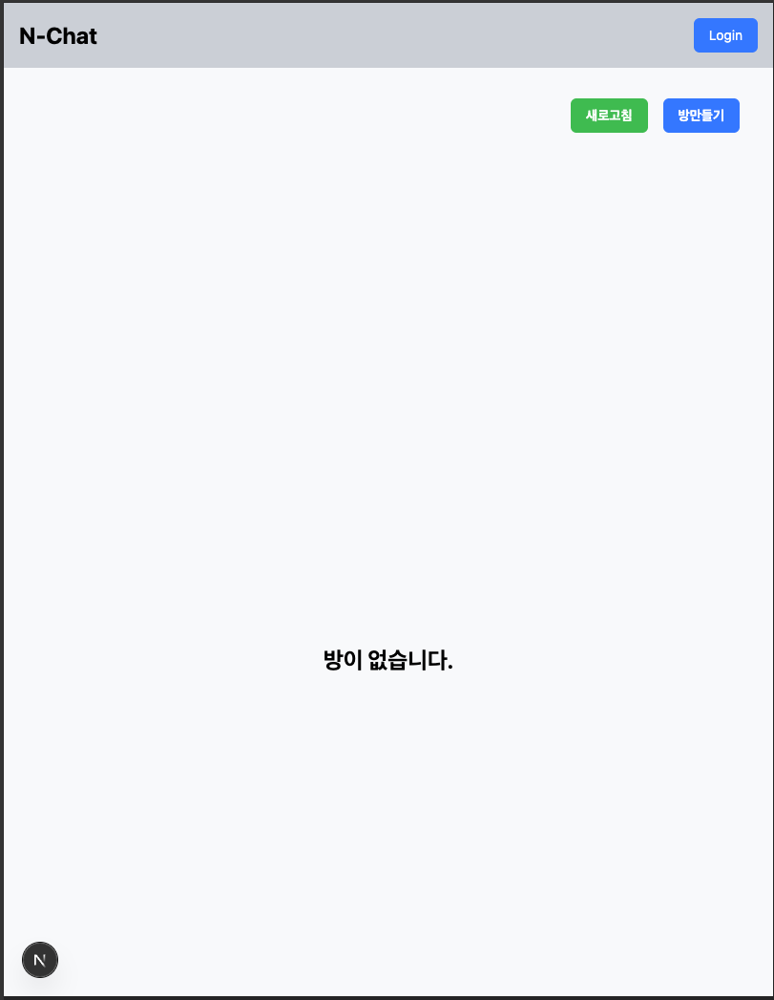
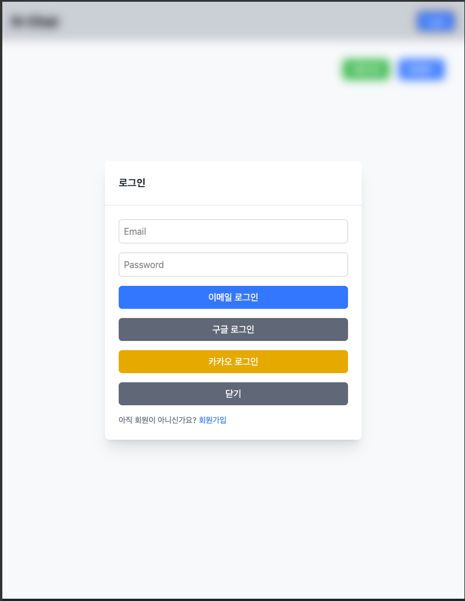
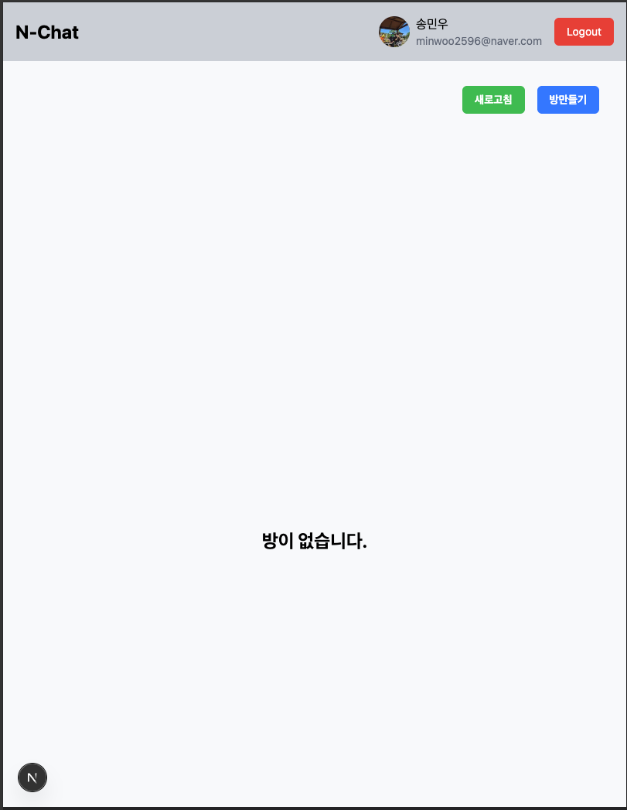
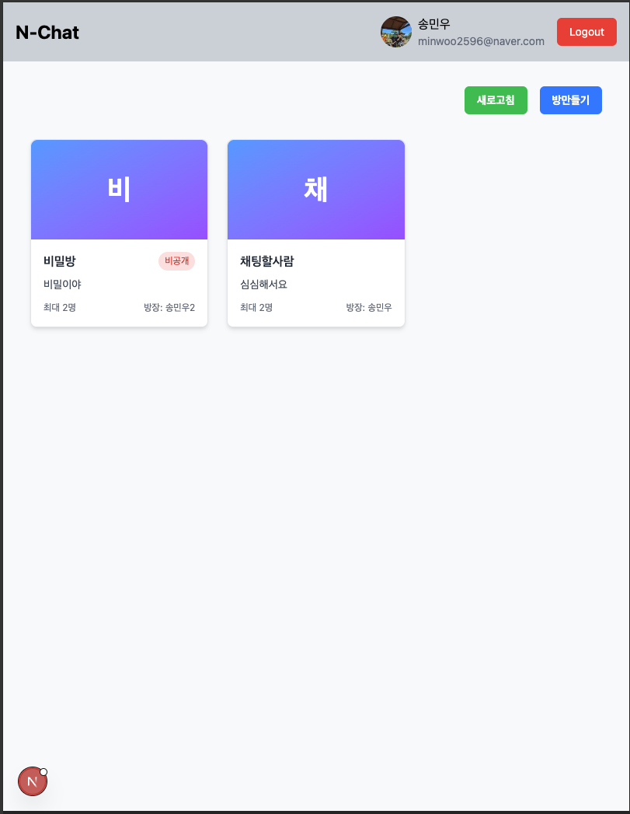
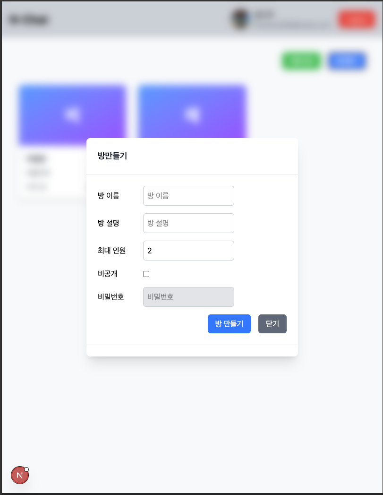
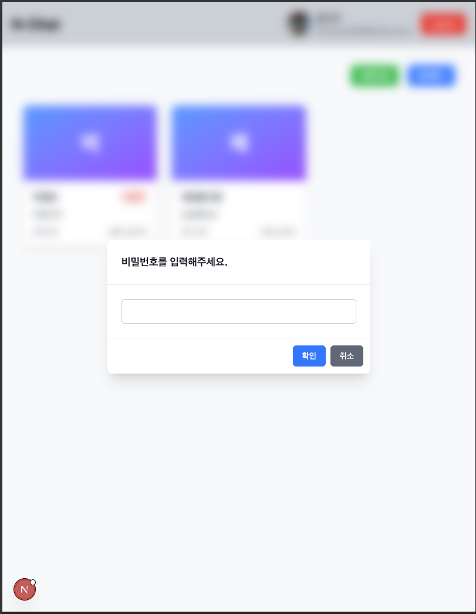
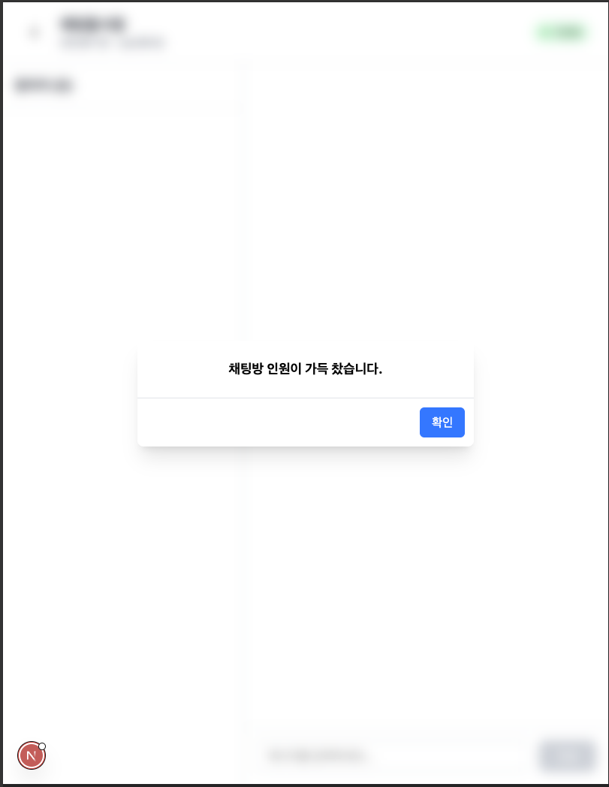
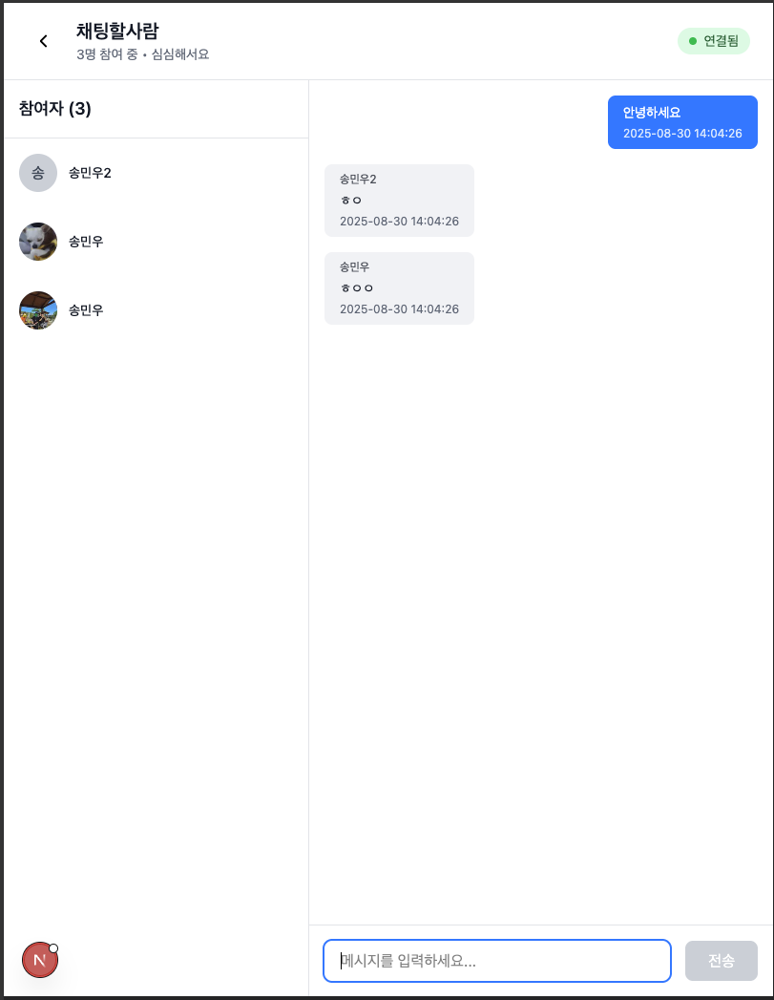

# N-Chat

NextJS와 NestJS를 이용한 실시간 채팅 서비스

## 📋 프로젝트 개요

N-Chat은 Next.js 프론트엔드와 NestJS 백엔드로 구성된 실시간 채팅 애플리케이션입니다. WebSocket을 통한 실시간 통신과 소셜 로그인(Google, Kakao)을 지원합니다.

## 🏗️ 기술 스택

### Frontend

- **Next.js 15.3.5** - React 기반 프레임워크
- **React 19** - UI 라이브러리
- **TypeScript** - 타입 안전성
- **Tailwind CSS** - 스타일링
- **Socket.io Client** - 실시간 통신
- **Zustand** - 상태 관리
- **Day.js** - 날짜 처리

### Backend

- **NestJS** - Node.js 백엔드 프레임워크
- **TypeScript** - 타입 안전성
- **Socket.io** - WebSocket 서버
- **TypeORM** - 데이터베이스 ORM
- **PostgreSQL** - 메인 데이터베이스
- **JWT** - 인증 토큰
- **Winston** - 로깅
- **Google/Kakao OAuth** - 소셜 로그인

## 🚀 주요 기능

- 🔐 **소셜 로그인**: Google, Kakao OAuth 지원
- 💬 **실시간 채팅**: WebSocket을 통한 실시간 메시지 전송
- 🏠 **채팅방 관리**: 방 생성, 입장, 퇴장, 목록 조회
- 👥 **사용자 관리**: 프로필 관리 및 사용자 정보
- 📱 **반응형 UI**: 모바일 친화적인 인터페이스
- 🔒 **JWT 인증**: 보안된 API 접근

## 📁 프로젝트 구조

```
n-chat/
├── frontend/                 # Next.js 프론트엔드
│   ├── src/
│   │   ├── app/             # App Router 페이지
│   │   ├── components/      # React 컴포넌트
│   │   ├── apis/           # API 호출 함수
│   │   ├── hooks/          # 커스텀 훅
│   │   ├── store/          # Zustand 상태 관리
│   │   └── types/          # TypeScript 타입 정의
│   └── package.json
├── backend/                 # NestJS 백엔드
│   ├── src/
│   │   ├── auth/           # 인증 관련 모듈
│   │   ├── chat/           # 채팅 관련 모듈
│   │   ├── user/           # 사용자 관련 모듈
│   │   ├── config/         # 설정 관리
│   │   └── postgres/       # 데이터베이스 설정
│   └── package.json
└── README.md
```

## 🛠️ 설치 및 실행

### Prerequisites

- Node.js 18+
- PostgreSQL
- Yarn 또는 npm

### Backend 설정

```bash
cd backend
yarn install

# 개발 서버 실행
yarn dev
```

### Frontend 설정

```bash
cd frontend
yarn install

# 개발 서버 실행
yarn dev
```

## 🔧 환경 변수

### Backend (.env)

```env
APP_NAME=
APP_PORT=
LOG_LEVEL=

BCRYPT_SALT=
JWT_SECRET=

# CORS
CORS_ORIGIN=
CORS_METHODS=GET,HEAD,PUT,PATCH,POST,DELETE
CORS_ALLOWED_HEADERS='Content-Type, Accept, Authorization'

# Postgres
POSTGRES_HOST=localhost
POSTGRES_PORT=5432
POSTGRES_USER=postgres
POSTGRES_PASSWORD=password
POSTGRES_DB=database name

# Google API
GOOGLE_CLIENT_ID=
GOOGLE_CLIENT_SECRET=
GOOGLE_REDIRECT_URI=

# Kakao API
KAKAO_API_URL=
KAKAO_REST_API_KEY=
KAKAO_REDIRECT_URI=

```

### Frontend (.env)

```env
NEXT_PUBLIC_API_URL=
NEXT_PUBLIC_ACCESS_TOKEN=
NEXT_PUBLIC_REFRESH_TOKEN=
```

## 구현화면

### 최초화면



### 로그인 화면


PostgreSQL에 저장되어 있는 이메일 로그인을 하거나, OAuth를 이용한 카카오 또는 구글 로그인을 할 수 있다.

### OAuth 로그인 후


카카오 로그인한 상태로 사용자 프로필 이미지 및 이름과 이메일 주소가 노출된다.

### 방 목록


일반 채팅방과 비공개 채팅방으로 생성할 수 있다.

### 채팅방


로그인 했을 경우에만 방에 접속할 수 있으며, 비공개 방은 비밀번호를 입력해야 한다.


채팅방에 인원이 꽉찼을 경우 접속할 수 없다.


